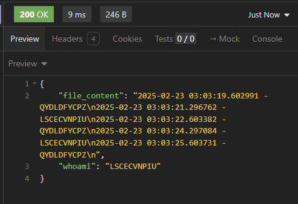

# Brief Setup Guide (Generated by Github-Copilot)

Follow these steps to set up and deploy your application on Kubernetes.

## Step 1: Build and Push Docker Image
Build the Docker image and push it to your Docker registry.
```sh
make build
make push
```

## Step 2: Create Kubernetes Resources
Create the necessary Kubernetes resources such as namespace, service, storage, and volume claim.
```sh
make create
```

## Step 3: Deploy the Application
Deploy the application to the Kubernetes cluster.
```sh
make deploy
```

## Step 4: Verify the Deployment
Verify that the application is running by accessing the service.
```sh
curl http://localhost:30001/file
```

## Expected Output:
You should see truncated output of the file, which is appended with "timestamp + pod signature" by each pod. Also, you can see the pod name in the response (to check the load balancing).


